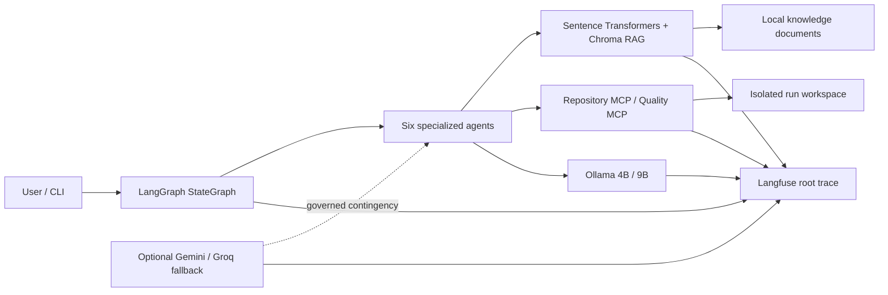

# Architecture diagram

```mermaid
flowchart LR
    U[User / CLI] --> G[LangGraph StateGraph]
    G --> A[Six specialized agents]
    A --> R[Sentence Transformers + Chroma RAG]
    A --> M[Repository MCP / Quality MCP]
    A --> O[Ollama 4B / 9B]
    R --> K[Local knowledge documents]
    M --> W[Isolated run workspace]
    G --> L[Langfuse root trace]
    R --> L
    M --> L
    O --> L
    C[Optional Gemini / Groq fallback] -. governed contingency .-> A
    C --> L
```

Conceptually: User → LangGraph → Agents → RAG / MCP → External Systems →
Langfuse. LangGraph alone owns transitions.
