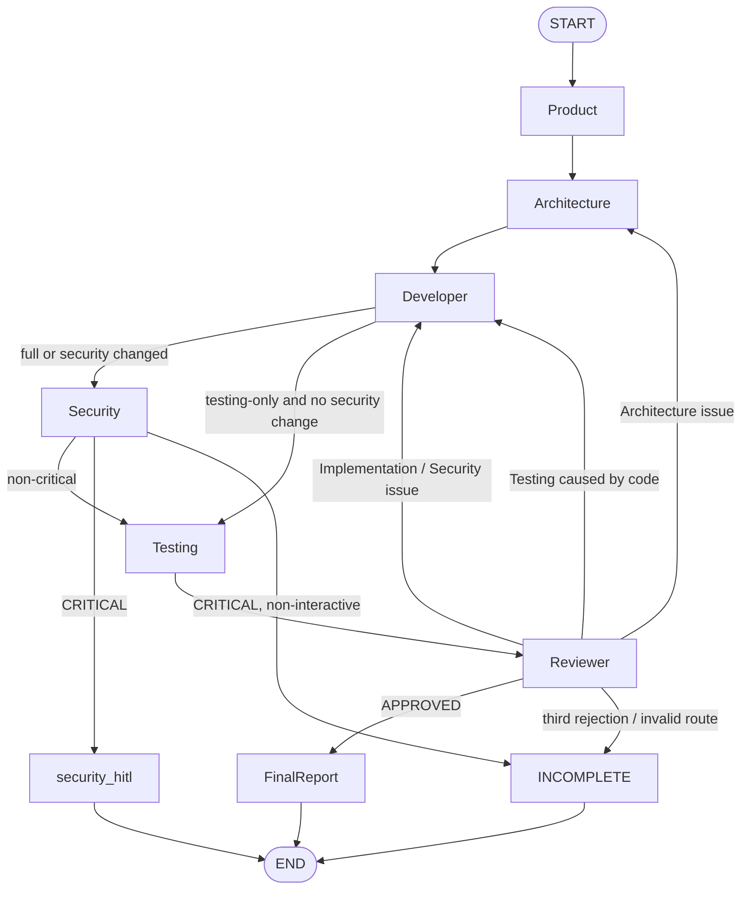

# LangGraph diagram

The Reviewer recommends; deterministic validation selects the edge. Iteration
increments exactly once per accepted rejection. Iterations 1 and 2 may loop;
the third rejection terminates automation as `INCOMPLETE`, so a fourth cycle
cannot start. LLM availability/quality errors use bounded retry/repair/fallback
routes; MCP, tool and RAG errors keep dedicated non-cloud paths and terminate
as `INCOMPLETE` when no recovery path remains. Interactive security HITL still
uses `security_hitl` with a checkpointer.
